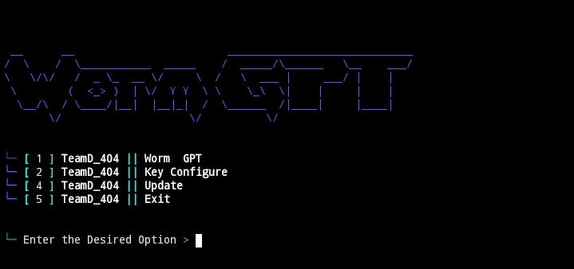

<h1 align="center">Worm-GPT<br>
</h1>


WormGPT is a malicious AI tool promoted on the dark web as the adversary of ChatGPT. Used by Black Hat Hacker in Hacking 

## Disclaimer

Please be aware of the following disclaimer before using this tool:

While using Hacx, it is important to understand that:

- Any actions taken using this tool are solely the responsibility of the user. Neither the creators of Hacx nor any other individuals or entities associated with it can be held responsible for any misuse or illegal activities performed with the tool.
- Hacx is intended for educational and learning purposes only. It is designed to facilitate understanding and exploration of natural language processing technologies.

By using Hacx, you agree to adhere to ethical guidelines and legal regulations governing the use of such tools. Any misuse or illegal activity conducted with Hacx is strictly prohibited.

## Tested On :
<ul>
  <li>Termux</li>
  <li>Kali Linux</>
</ul>


## Installation 

Update the packages
```bash
pkg up -y
```
Install some dependencies
```bash
pkg install git wget python -y
```
Clone the repository
```bash
git clone https://github.com/TeamD-404/Worm-GPT
```
Go to the W0rm-Gpt directory
```bash
cd Worm-GPT
```
Now Install the Requirements 
```bash
pip install -r requirements.txt
```
Run the script
```bash
python WormGPT.py
```


## Get the Api Key

[Get Api Key](https://platform.openai.com/api-keys)

## Features
* `Can do anything you want !!`

* `All Ai chatbot and all questions will be answered in goodflow`

## Note
* `This Chat Worm-GPT is mainly to get knowledge not for other purposes!`

## Telegram Channel

* `All updates of Team Sincryption will be posted here >> @TeamD404Support`

<a href="https://t.me/TeamD404Support">
